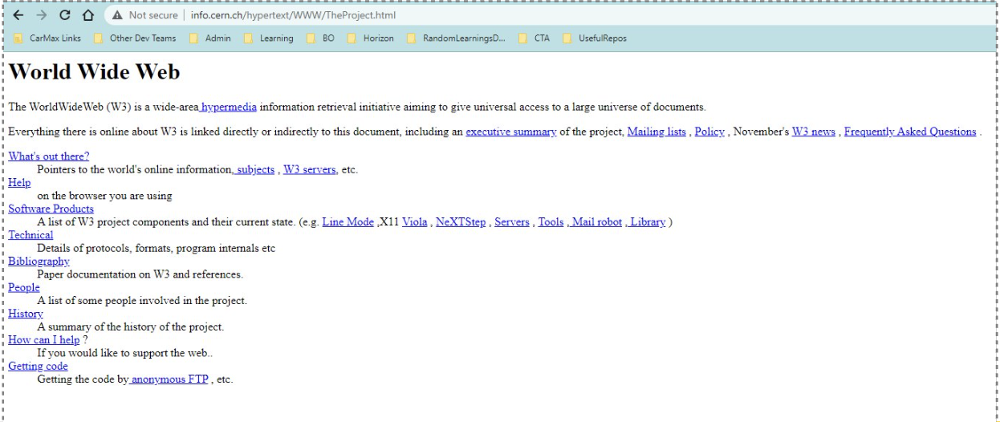
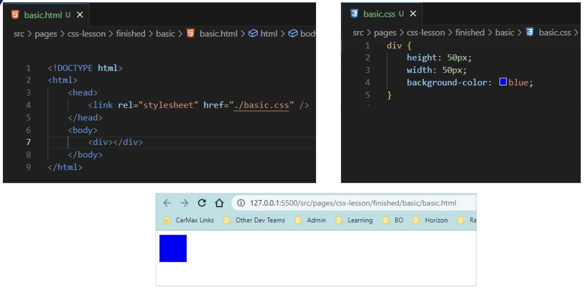
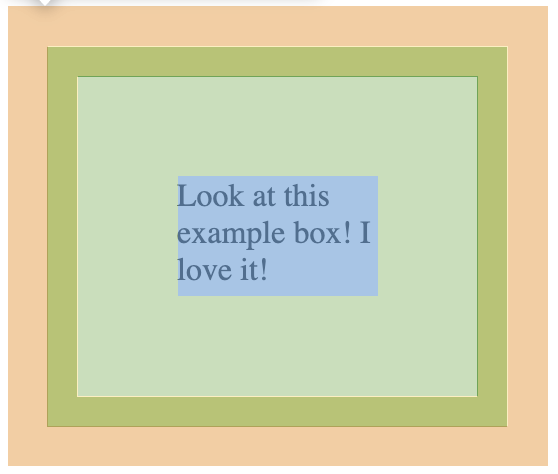
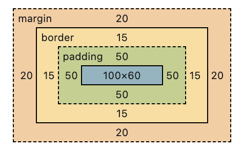
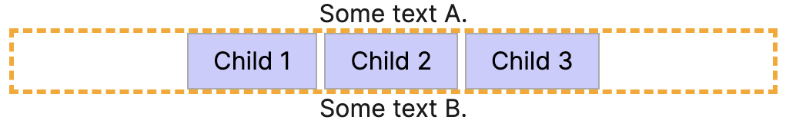
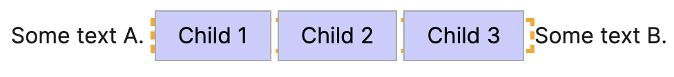
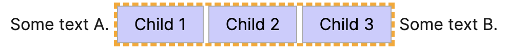
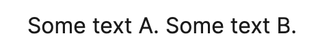

# CSS Lesson

## Table of Contents
- [What is CSS?](#what-is-css)
- [In a world before CSS](#in-a-world-before-css)
- [Basic HTML & CSS File](#basic-html--css-file)
- [CSS Syntax & Basic Properties](#css-syntax--basic-properties)
- [How to Include CSS](#how-to-include-css)
- [CSS Selectors](#css-selectors)
- [CSS Box Model](#css-box-model)
- [CSS Display](#css-display)
- [CSS Units](#css-units)
- [CSS Positioning](#css-positioning)
- [CSS Specificity](#css-specificity)

## What is CSS?
- **Cascading Style Sheets (CSS)** is the standard browser language used to *style* HTML content for users
- Maintained by the World Wide Web Consortium (W3C)
  - Officially released in 1996, three years after HTML
- Used to add colors, fonts, layouts, animations, etc.

## In a world before CSS
- All presentational attributes were embedded directly into HTML using attributes
- Limited design abilities led to visually unappealing web pages, lacking in aesthetics 
- http://info.cern.ch/hypertext/WWW/TheProject.html



## CSS Syntax & Basic Properties
- CSS follows a simple pattern: `selector { property: value; }`
- Essential properties to know:
  | Property | Description | Example |
  | --- | --- | --- |
  | `color` | Text color | `color: red;` |
  | `background-color` | Background color | `background-color: blue;` |
  | `font-size` | Size of text | `font-size: 18px;` |
  | `width` | Element width | `width: 300px;` |
  | `height` | Element height | `height: 200px;` |
  | `margin` | Space outside element | `margin: 10px;` |
  | `padding` | Space inside element | `padding: 15px;` |

## How to Include CSS
There are three ways to add CSS to HTML:

1. **Inline CSS** - directly in HTML elements
   ```html
   <p style="color: red; font-size: 16px;">Red text</p>
   ```

2. **Internal CSS** - in the `<head>` section
   ```html
   <head>
     <style>
       p { color: red; font-size: 16px; }
     </style>
   </head>
   ```

3. **External CSS** - separate `.css` file (recommended)
   ```html
   <head>
     <link rel="stylesheet" href="styles.css">
   </head>
   ```

## Basic HTML & CSS File


## CSS Selectors
- Selectors are used to "select" the HTML elements you want to style
- There are over 50 of them
  - Most Common:
    | Selector | CSS Example | HTML Example |
    | --- | --- | --- |
    | element | `p { color: red; }` | `<p>My Text</p>` |
    | class | `.small { ... }` | `<p class="small">My Text</p>` |
    | id | `#id { ... }` | `<p id="intro">My Text</p>` |
    | combinators | `div > p { ... }` | `<div> <p>My Text</p> </div>` |
- [CSS Selector Tester](https://www.w3schools.com/cssref/trysel.php) to play around with different selectors

## CSS Box Model 
- The Box Model represents an invisible box which wraps each HTML Element
- It consists of: content, padding, borders and margins
  - padding and margin are transparent
```
div {
    width: 100px;
    height: 60px;
    border: 15px solid green;
    padding: 50px;
    margin: 20px;
}
```



## CSS Display 
- The display property sets if/how an element is displayed
- Most common values, represented by changing the display of a `div` which contains 3 child elements:
  - `block`
  
  - `inline`
  
  - `inline-block`
  
  - `none`
  
  - `flex`
    - [Flexbox froggy](https://flexboxfroggy.com/)

## CSS Units
- Different ways to specify sizes and distances
- Most common units:
  | Unit | Description | Example Use Case |
  | --- | --- | --- |
  | `px` | Pixels (absolute) | Borders, small fixed sizes |
  | `%` | Percentage of parent | Responsive widths |
  | `em` | Relative to parent font size | Scalable spacing |
  | `rem` | Relative to root font size | Consistent sizing |
  | `vh/vw` | Viewport height/width | Full-screen layouts |

## CSS Positioning
- Controls how elements are positioned on the page
- Position values:
  | Position | Description | Example |
  | --- | --- | --- |
  | `static` | Default, normal flow | `position: static;` |
  | `relative` | Relative to its normal position | `position: relative; top: 10px;` |
  | `absolute` | Relative to nearest positioned parent | `position: absolute; top: 0; right: 0;` |
  | `fixed` | Relative to viewport | `position: fixed; top: 0;` (sticky header) |

## CSS Specificity
- Specificity is the weight in which styles apply, meaning it determines which CSS declaration is the property value that should be applied to the HTML element
- 5 buckets of specificity (0-0-0-0-0)
  - HTML element
  - Class
  - Id
  - Inline styles
  - !important
- Calculating specificity
  - Simply identify your selectors and add them up
  - #id – .class – element​
    - 0 - 0 - 0
  - ex.
    - | selectors | weight |
      | --- | --- |
      | `div` | 0-0-1 |
      | `.myClass` | 0-1-0 |
      | `#myId` | 1-0-0 |
      | `section#about > aside.authors > ul > li` | 1-1-4 |
- Additional resources on specificity
  - https://specifishity.com/
  - https://www.w3schools.com/cssref/css_selectors.php​
