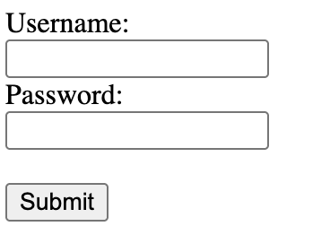

# HTML

## Table of Contents
- [What is HTML?](#what-is-html)
- [What is an HTML Element?](#what-is-an-html-element)
- [HTML Attributes](#html-attributes)
- [HTML: Document Structure](#html-document-structure)
- [Essential HTML Elements](#essential-html-elements)
- [HTML: Hyperlinks](#html-hyperlinks)
- [HTML: Semantics](#html-semantics)
- [HTML: Debugging](#html-debugging)

## What is HTML?

- Stands for **HyperText Markup Language**
- It is the structure and semantics of a webpage, and is the most basic building block of the Web
- It consists of a series of elements that tell the browser how to display the content

## What is an HTML Element?

HTML elements are defined by a start tag, the content, and an end tag
- `<tag> Content </tag>`

### Some Example Element Types
| Element | Description |
|---|---|
| `<html>` | Represents the root of an HTML document, all other elements are descendants of this element |
| `<h1>` to `<h6>` | Headings with a hierarchy, `<h1>` is the biggest and `<h6>` is the smallest heading | 
| `<li>` | Used to represent an item in a list, must be used inside ordered `<ol>` or unordered `<ul>` list | 
| `<p>` | Represents a paragraph | 
| `<a>` | Used to create hyperlink to web pages | 
| `<div>` | Generic block container, used as the foundation for layouts | 
| `<span>` | Similar to a `<div>` but used as a generic *inline* container| 
| `<section>` | Defines a section in a document, used to create groupings of content | 
| `<br>` | This is considered an "empty" element, because it has no content and no end tag. It is used to create a break in the document | 
| `<form>` | This element represents a document section containing interactive controls for submitting information | 

### HTML Attributes
- Attributes provide additional information about HTML elements
- Written inside the opening tag: `<tag attribute="value">Content</tag>`
- Common attributes:
  | Attribute | Purpose | Example |
  |---|---|---|
  | `id` | Unique identifier for an element | `<div id="header">` |
  | `class` | Groups elements for styling | `<p class="intro">` |
  | `src` | Source file for images/media | `` |
  | `href` | Link destination | `<a href="https://example.com">` |
  | `alt` | Alternative text for images | `` |
  | `type` | Specifies input or button type | `<input type="email">` |

### Essential Elements
Headers and paragraphs 
```html
<h1>This is an example header</h1>
<p>This is an example paragraph</p>
```

Buttons have a `type` attribute that describes to the browser what kind of button it is [(i.e. button, reset, submit)](https://www.w3schools.com/tags/tag_button.asp)
```html
<button type="button">I am a button!</button>
```

Forms tend to consist of `input`s and `label`s. Labels allow for a description of what the inputs accept. Inputs can have many different types, including text, checkboxes, radio buttons, and more! In order for the `input` and `label` elements to communicate, the `for` attribute of the label must match the `id` label of the input.
```html
<form>
  <label for="uname">Username:</label><br>
  <input type="text" id="uname" name="uname"><br>
  <label for="pword">Password:</label><br>
  <input type="text" id="pword" name="pword"><br><br>
  <input type="submit" value="Submit">
</form>
```


Common Input Types
```html
<input type="text" placeholder="Enter your name">
<input type="email" placeholder="Enter your email">
<input type="password" placeholder="Enter password">
<input type="number" min="1" max="100">
<input type="checkbox" id="agree">
<input type="radio" name="size" value="small">
```

Tables (for structured data)
```html
<table>
    <thead>
        <tr>
            <th>Name</th>
            <th>Age</th>
        </tr>
    </thead>
    <tbody>
        <tr>
            <td>John</td>
            <td>25</td>
        </tr>
    </tbody>
</table>
```

Images
```html

```

## HTML: Document Structure
HTML document has three required [elements](https://developer.mozilla.org/en-US/docs/Web/HTML/Reference/Elements)
- `<html>` which wraps both the `<head>` and the `<body>`
- `<head>` for metadata
  - this includes elements such as `<style>`, `<script>`, `<title>`, and `<meta>`
- `<body>` for content read and interacted with by the user
  - this includes elements such as `<p>` , `<button>`, `<li>`, and more


### Complete HTML Document Template
Every HTML document should start with this basic structure:
```html
<!DOCTYPE html>
<html lang="en">
<head>
    <meta charset="UTF-8">
    <meta name="viewport" content="width=device-width, initial-scale=1.0">
    <title>My Page Title</title>
</head>
<body>
    <h1>Welcome to my website!</h1>
    <p>This is where your content goes.</p>
</body>
</html>
```

## HTML: Hyperlinks
- Hyperlinks allow HTML documents to reference other HTML documents by different publishers
- Primary motivation for why the web was created - to dynamically link citations!
- Identified by `<a>` tags

## HTML: Semantics
What is "semantic" HTML?
- Semantic HTML organizes and describes the *content using native browser tags*
- Benefits include accessibility and developer readability
- Everything should not simply be a `<div>` or a `<span>`!
  - These tell us nothing about the content displayed
  - Semantic elements include: ``, `<table>`, and `<article>`


## HTML: Debugging
- Any URL can be inspected to see the HTML under it
- Take a look at [CarMax](https://www.carmax.com/)'s HTML!
  - Right click + "Inspect element"
  - "Elements" tab will show you the complete HTML
- Additional resources:
  - [Debugging HTML](https://developer.mozilla.org/en-US/docs/Learn_web_development/Core/Structuring_content/Debugging_HTML)